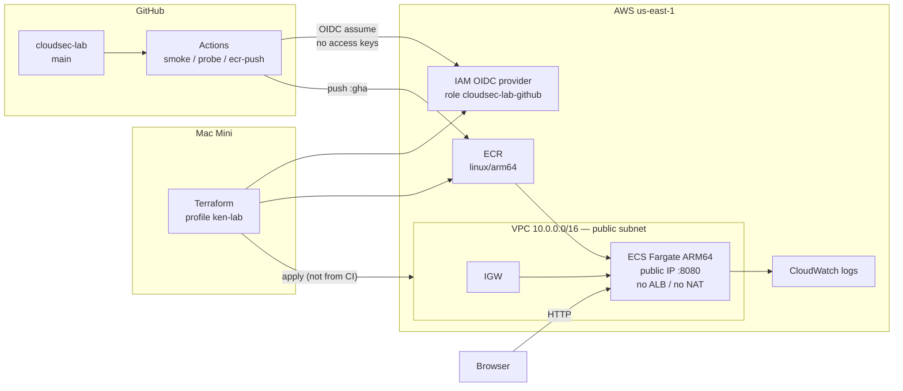

# cloudsec-lab

Hands-on CloudSec / CNAPP lab. The Flask app is a health page. **Infrastructure and how it is changed are the point.**



Terraform apply stays on the laptop. Actions does **not** apply. There is no `deploy.yml` yet: CI can assume AWS and push an image; starting/stopping the service is still Terraform.

## Design

- **No ALB, no NAT, no EKS.** One public subnet, task gets a public IP, hit `:8080`. HTTPS needs a hostname; not in this shape.
- **Fargate is ARM64** (256 CPU / 512 MB). GitHub-hosted runners are amd64, so CI builds with QEMU/Buildx `linux/arm64`.
- **`desired_count` is in Terraform** on purpose — `apply -var='desired_count=0'` is the stop switch. Scale to 0 when the laptop closes.
- **No AWS keys in GitHub Secrets.** Role `cloudsec-lab-github` trusts this repo’s `main` only (OIDC `sub` includes GitHub owner/repo numeric IDs).
- **Workflows are path-filtered** (plus **Run workflow**). README-only commits must not start a run. Do not add `README.md` to `on.push.paths`.

### Terraform vs live ECS fields

This lab **does** manage `desired_count` in Terraform so apply is start/stop.

On a long-running service you usually **do not**. Terraform converges to the file. Autoscaling and deploys change `desired_count` (and often the task definition) out of band; the next apply would reset them. Typical split: Terraform owns cluster, network, IAM, maybe autoscaling min/max; the service uses `lifecycle { ignore_changes = [desired_count] }` (and often `task_definition` if CI registers new revisions). Same for the image: if CI pushed `:gha` and Terraform still says `latest`, apply will try to revert it.

If you last applied with `-var='image_tag=gha'`, pass that var again on scale-down so only the count changes.

## What’s in AWS (`us-east-1`)

| Piece | What it is |
|-------|------------|
| VPC `10.0.0.0/16` | One public subnet `10.0.1.0/24` in `us-east-1a`, IGW, SG on container port 8080 |
| ECR `cloudsec-lab` | Scan on push; lifecycle keep last 5. Tags: `latest` (laptop), `gha` + commit SHA (Actions) |
| ECS cluster + service `cloudsec-lab` | Fargate, `assign_public_ip=true`. Task def points at `ECR:image_tag` |
| IAM | Task/execution roles; GitHub OIDC provider; deploy role (ECR push, ECS describe/update, `PassRole` on the two task roles only) |
| CloudWatch | `/ecs/cloudsec-lab` logs |

State is **local** (`terraform/terraform.tfstate`, gitignored). Tags: `Environment=Lab`, `Owner=Ken`, `AutoShutdown=true`.

CLI: Terraform `$HOME/.local/bin`, AWS `$HOME/Library/Python/3.9/bin`, profile **`ken-lab`**. Docker `/usr/local/bin`.

## GitHub Actions

| Workflow | Does | Does not |
|----------|------|----------|
| `oidc-smoke` | Assume the GitHub role; `sts get-caller-identity` | Touch ECR/ECS |
| `oidc-probe` | Same, then read-only ECR/ECS describe | Push or start tasks |
| `ecr-push` | OIDC → login → build `linux/arm64` → push `:gha` and `:sha` | Retag `latest`; change `desired_count` |

## Operate

```bash
export PATH="$HOME/.local/bin:$HOME/Library/Python/3.9/bin:$PATH"
export AWS_PROFILE=ken-lab
cd terraform
```

First create (or after clone): `terraform init && terraform plan && terraform apply` (default desired 0).

```bash
# start — use the image tag currently on the task def
terraform apply -var='desired_count=1' -var='image_tag=gha'
../scripts/ecs-url.sh          # public IP; new each start

# stop — same image_tag so Terraform does not swap :gha back to :latest
terraform apply -auto-approve -var='desired_count=0' -var='image_tag=gha'
```

Teardown everything: `terraform destroy`.

Push from the Mac (tag `latest`) only if you are not using the Actions image:

```bash
aws ecr get-login-password --region us-east-1 | docker login --username AWS --password-stdin "$(aws sts get-caller-identity --query Account --output text).dkr.ecr.us-east-1.amazonaws.com"
docker tag cloudsec-lab:latest "$(terraform -chdir=terraform output -raw ecr_repository_url):latest"
docker push "$(terraform -chdir=terraform output -raw ecr_repository_url):latest"
```

## App (local)

`APP_ENV` is `local` / `docker` / `aws`. `/health` returns `{"status":"healthy"}`.

```bash
cd app && python3 -m venv .venv && source .venv/bin/activate
pip install -r requirements.txt && python app.py
# http://localhost:8080
```

```bash
docker build -t cloudsec-lab .
docker run --rm -p 8080:8080 cloudsec-lab
```

## Layout

```
app/                    Flask
Dockerfile
terraform/              VPC, ECR, ECS, OIDC (apply locally)
.github/workflows/      smoke, probe, ecr-push
scripts/ecs-url.sh      print running task URL
```

Not in this repo yet: Trivy, Gitleaks, Prowler, Cloud Custodian, `deploy.yml`.
